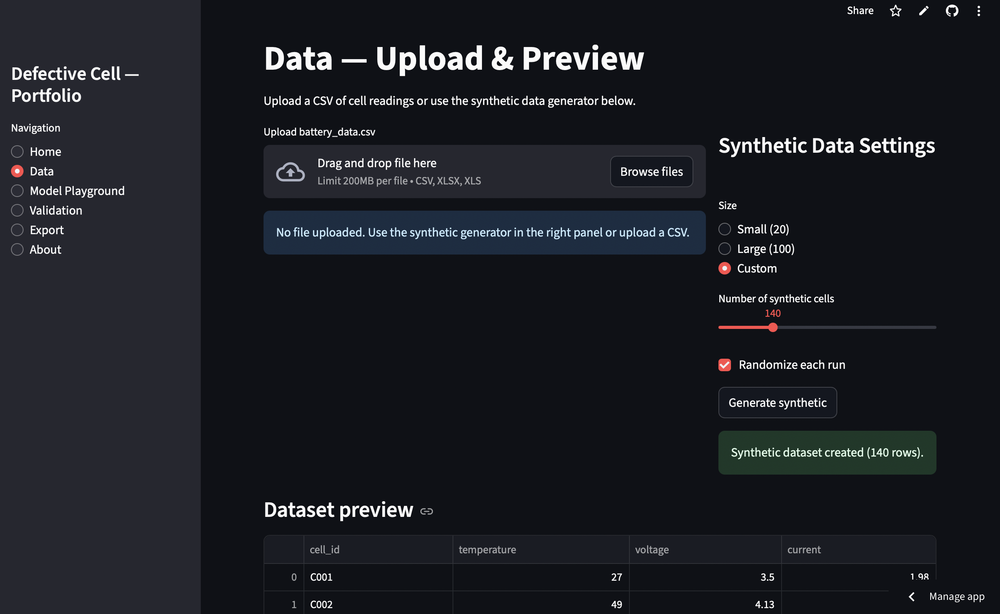
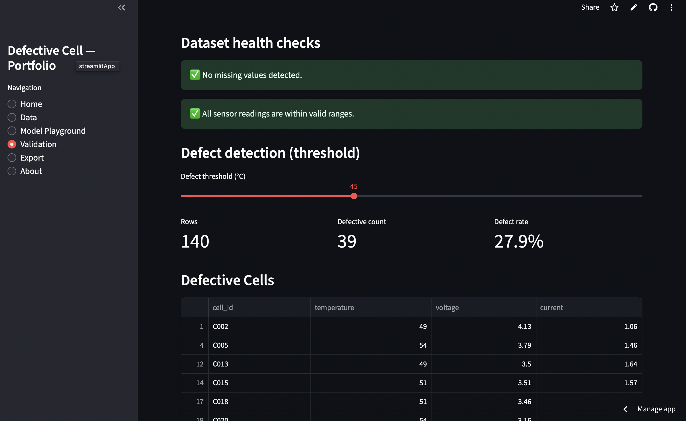
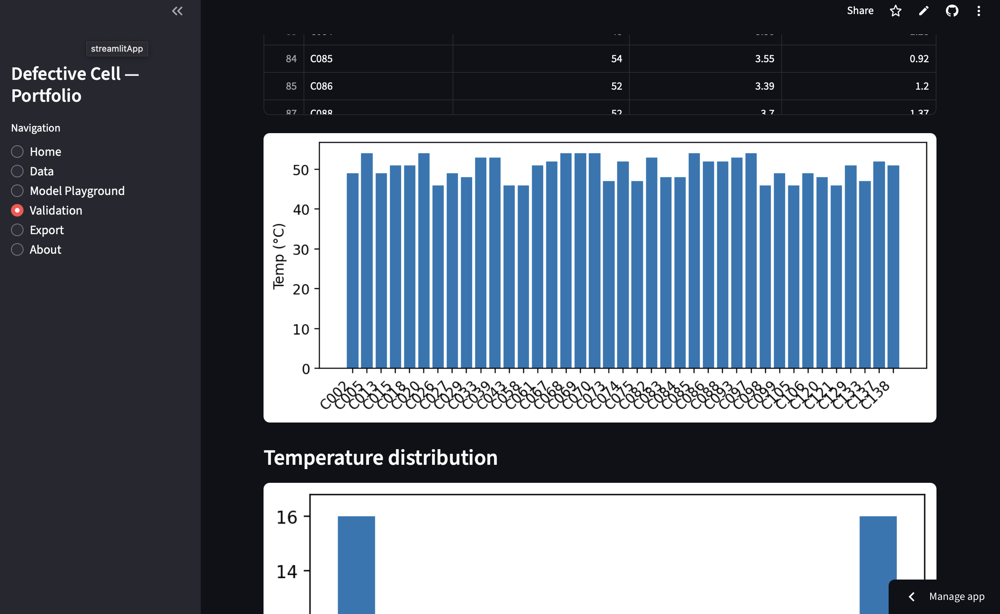
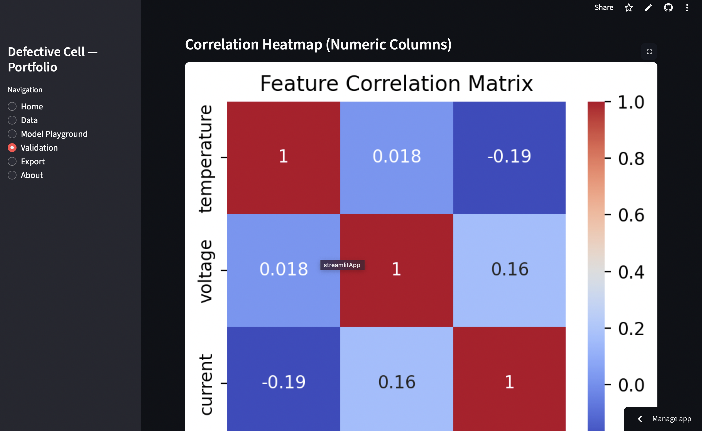
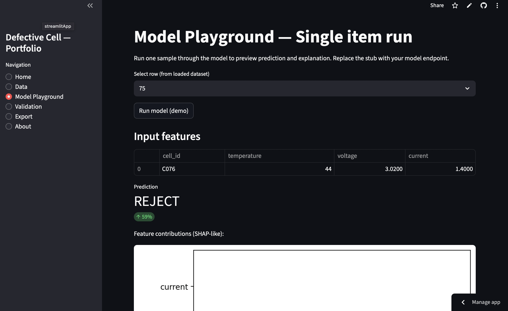
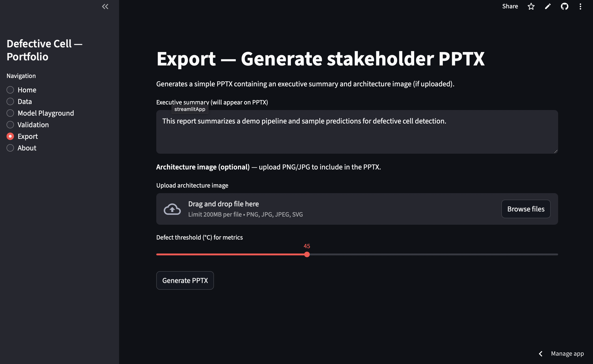

# EV Battery Defect Detection — Streamlit Portfolio Demo

[](https://ginwalla-ev-battery-defect-dashboard.streamlit.app)


**Short pitch**  
Interactive Streamlit demo that showcases a lightweight pipeline to detect defective EV battery cells from sensor logs. Includes data upload, synthetic data generator, validation, a model playground (demo), lightweight explainability, and PPTX export.

---

## Live demo
Live app: **`<paste your Streamlit URL here>`**

## Loom demo (4–5 min)
Watch: **https://www.loom.com/share/e9eb163f4e8a4de6a5be49afc1b2f4ca?sid=15fbb21a-4ecb-4b07-a1fe-e4328dd12875**

---

## Screenshots

### Home / Data Source


### Validation — Data Health Checks


### Validation — Histogram & Heatmap
  


### Model Playground


### Export / PPTX


---

## Features
- Upload CSV or generate synthetic data
- Dataset validation (missing values, invalid ranges)
- Visualizations: histograms, fast cached correlation heatmap
- Model playground with single-sample inference (demo stub) and simulated explainability
- Session history of predictions and CSV export
- Export a stakeholder PPTX with architecture image and summary

---

## Quick start (local)

1. Clone the repo:
```bash
git clone https://github.com/YOUR_USERNAME/ev-battery-defect-dashboard.git
cd ev-battery-defect-dashboard